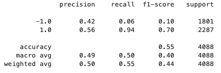

# ASSIGNMENT11--08-22
# MODULE 14 - Machine Learning Trading Bot

## Establish a Baseline Performance

In the analysis of the OHLCV dataset, we initiated by implementing the SMA (Simple Moving Average) technique. The model was trained using a short window of 4 and a long window of 100. Following this, we employed the Support Vector Machine (SVM) learning method to fit the training data and make predictions based on the testing data.

### Classification Report

The classification report for the baseline model using the SVM classifier is as follows:

This report shows that the model has a higher precision and recall for "Buy" (1.0) signals compared to "Sell" (-1.0) signals, indicating that the model tends to perform better in predicting buying opportunities.

### Actual Return vs. Strategy Return

The graph below shows the cumulative return of the actual returns compared to the strategy returns for the baseline model:

Observing the graph, it is possible to visualize that the Strategy returns had a higher cumulative return over the Actual returns. This indicates that the baseline model's trading strategy had a positive impact on returns compared to simply holding the asset.

## Tune the Baseline Trading Algorithm

### Step 1: Adjusting Training Dataset Size

In the first step of tuning the baseline trading algorithm, we experimented with the size of the training dataset. Instead of the initial 3 months, the dataframe was sliced into 5 months. This adjustment had a notable impact on the return of the strategy. The findings are as follows:

### Classification Report

The classification report for the tuned model with a 5-month training window is as follows:

This report indicates a balance between precision and recall for both "Buy" (1.0) and "Sell" (-1.0) signals, suggesting an improved performance.

### Actual Return vs. Strategy Return

The graph below displays the cumulative return of the actual returns compared to the strategy returns with a 5-month training window:

The extended training window led to better performance in scenarios with similar occurrences. However, it caused a significant decline when the market trends changed direction. Conversely, reducing the training window had a consistent negative impact on the return of the strategy.

This step illustrates the importance of selecting an appropriate training dataset size, as it can significantly influence the algorithm's performance. Further steps will continue to fine-tune the trading algorithm for optimal results.

### Step 2: Adjusting SMA Input Features

In the second step of tuning the baseline trading algorithm, we focused on adjusting the Simple Moving Average (SMA) input features. Specifically, we kept the training dataset size at 5 months and increased the long window to 110. This change had notable effects on the algorithm's performance, as follows:

### Classification Report

The classification report for the tuned model with a 5-month training window and a long SMA window of 110 is as follows:

While this adjustment led to improved recall, the return of the trading strategy was significantly inferior. Further changes to the long SMA window in both directions showed unsatisfactory results.

### Step 3: Selecting the Best Parameter Set

In the final step of tuning the trading algorithm, we aimed to choose the set of parameters that best improved the trading algorithm returns. By keeping the training dataset size at 3 months and changing the long SMA window to 110, it was possible to obtain a small increase in the return of the strategy. Other changes, both upwards and downwards, resulted in a decline in the return of the strategy.

### Classification Report

The classification report for the selected parameter set with a 3-month training window and a long SMA window of 110 is as follows:

This parameter set achieved a slight increase in the return of the trading strategy. It represents the choice that best improved the trading algorithm's returns during this tuning process.

These steps demonstrate the importance of fine-tuning trading algorithms to optimize their performance, considering various parameter sets and their impact on returns. Further refinements may be explored to achieve even better results.
